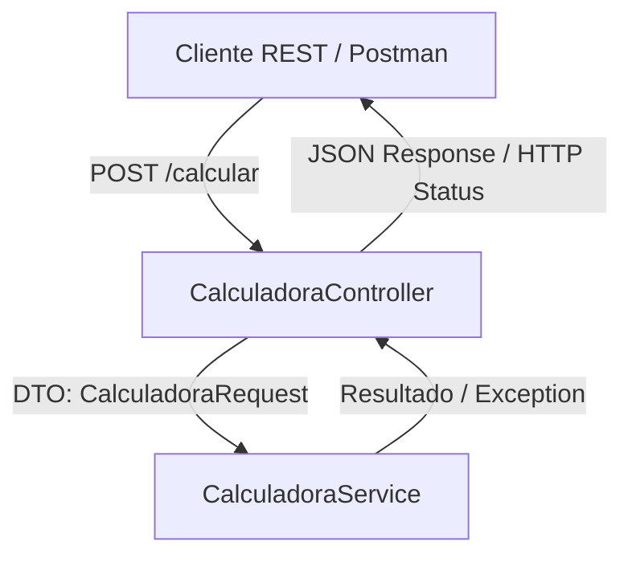

# Calculadora Spring Project

Una API REST sencilla construida con Spring Boot que proporciona operaciones aritméticas básicas (`+`, `-`, `*`, `/`).

## 🚀 Descripción General

Este proyecto implementa una calculadora web a través de un endpoint REST. Utiliza una arquitectura limpia en capas (Controladores, Servicios y Entidades/DTOs), con validaciones para operaciones matemáticas no válidas (como la división por cero).

---

## 🛠️ Tecnologías Principales

- **Framework:** Spring Boot 4.0.3
- **Lenguaje:** Java 17 (Ejecutándose en Java 25 de manera compatible)
- **Herramienta de Construcción:** Maven
- **Librerías Clave:**
  - **Lombok:** Para reducir el código boilerplate (Getters, Setters, Constructores, etc.).
  - **JUnit 5 & Mockito:** Para pruebas unitarias robustas y mocking de dependencias.

---

## 🏗️ Arquitectura del Proyecto

El proyecto sigue un diseño arquitectónico clásico en capas:



### Estructura de Paquetes:
- **Controladores (`cl.usm.calculadoraspring.controllers`):** Manejan las peticiones REST, validan entradas de forma básica y gestionan las respuestas y códigos HTTP.
- **Servicios (`cl.usm.calculadoraspring.services`):** Contienen la lógica de negocio para las operaciones aritméticas y validaciones matemáticas.
- **Entidades/DTOs (`cl.usm.calculadoraspring.entities`):** Estructuras de datos de transferencia para el cuerpo de la petición (`CalculadoraRequest`).

---

## 🚦 Endpoints de la API

### POST `/calcular`

Realiza una operación aritmética entre dos números.

#### Cuerpo de la Petición (Request Body)
```json
{
  "operation": "+",
  "n1": 10.0,
  "n2": 5.0
}
```

*Valores permitidos para `operation`:* `"+"`, `"-"`, `"*"` o `"/"`.

#### Respuestas HTTP

- **200 OK:** Operación exitosa. Retorna el resultado numérico.
  ```json
  15.0
  ```
- **400 Bad Request:** Entrada inválida (operación no soportada o división por cero).
  ```json
  "can't divide by zero"
  ```
- **500 Internal Server Error:** Error interno no controlado del servidor.

---

## 💻 Construcción y Ejecución

### Prerrequisitos
- JDK 17 o superior instalado.

### Construir el Proyecto
```bash
./mvnw clean compile
```

### Ejecutar la Aplicación
```bash
./mvnw spring-boot:run
```

### Ejecutar Pruebas Unitarias
```bash
./mvnw test
```

---

## 📐 Convenciones de Desarrollo

- **Uso de Lombok:** Se utilizan anotaciones como `@Getter`, `@Setter`, `@ToString`, `@AllArgsConstructor` y `@NoArgsConstructor` en las clases DTO para mantener un código limpio y legible sin boilerplate superfluo.
- **Capa de Servicio:** Toda la lógica de negocio (incluyendo la validación de operaciones y la comprobación de divisiones por cero) debe residir estrictamente en la clase de servicio.
- **Manejo de Errores:** `CalculadoraController` captura excepciones específicas (`NumberFormatException` para errores controlados de negocio) y genéricas, retornando los códigos HTTP apropiados (`400 BAD REQUEST` para errores de formato/matemáticos o `500 INTERNAL SERVER ERROR` para fallos genéricos).
- **Pruebas (Testing):**
  - Mantener una alta cobertura tanto en la capa de controladores como en la de servicios.
  - Usar Mockito para mockear la capa de servicio al realizar pruebas unitarias sobre los controladores.

---

## 📂 Archivos Clave del Proyecto

- 📄 **[CalculadoraController.java](file:///C:/Users/Alumnos_IBT/calculadoraspring/src/main/java/cl/usm/calculadoraspring/controllers/CalculadoraController.java):** Define el endpoint REST `/calcular` y gestiona las respuestas y control de excepciones.
- 📄 **[CalculadoraService.java](file:///C:/Users/Alumnos_IBT/calculadoraspring/src/main/java/cl/usm/calculadoraspring/services/CalculadoraService.java):** Implementa la lógica de cálculo (`+`, `-`, `*`, `/`) y lanza excepciones ante entradas inválidas.
- 📄 **[CalculadoraRequest.java](file:///C:/Users/Alumnos_IBT/calculadoraspring/src/main/java/cl/usm/calculadoraspring/entities/CalculadoraRequest.java):** Objeto DTO para mapear el cuerpo de la petición REST.
- 📄 **[CalculadoraControllerTest.java](file:///C:/Users/Alumnos_IBT/calculadoraspring/src/test/java/cl/usm/calculadoraspring/controllers/CalculadoraControllerTest.java):** Pruebas unitarias para el controlador utilizando JUnit 5 y Mockito.
- 📄 **[CalculadoraServiceTest.java](file:///C:/Users/Alumnos_IBT/calculadoraspring/src/test/java/cl/usm/calculadoraspring/services/CalculadoraServiceTest.java):** Pruebas unitarias completas de la lógica aritmética de la calculadora.
- 📄 **[CalculadoraspringApplication.java](file:///C:/Users/Alumnos_IBT/calculadoraspring/src/main/java/cl/usm/calculadoraspring/CalculadoraspringApplication.java):** Clase de entrada principal que arranca la aplicación Spring Boot.
- 📄 **[openapi.yaml](file:///C:/Users/Alumnos_IBT/calculadoraspring/docs/openapi.yaml):** Especificación OpenAPI 3.1.1 en formato YAML para documentación interactiva de la API.
- 📄 **[openapi.json](file:///C:/Users/Alumnos_IBT/calculadoraspring/docs/openapi.json):** Especificación OpenAPI 3.1.1 en formato JSON para integraciones automatizadas.
